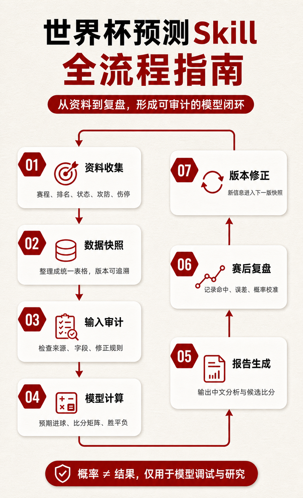
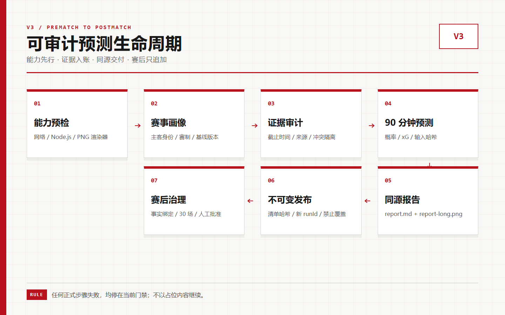
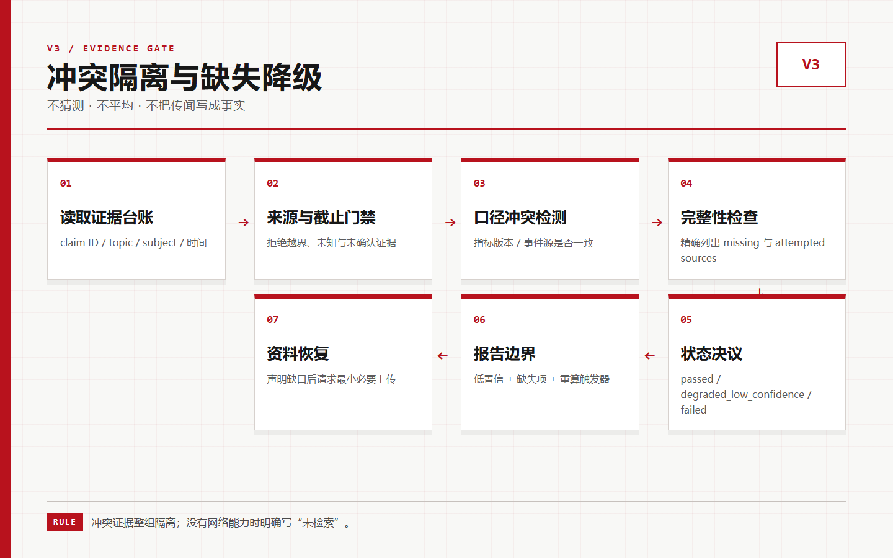
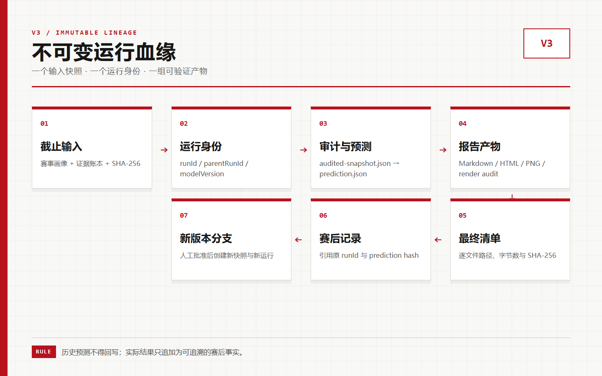
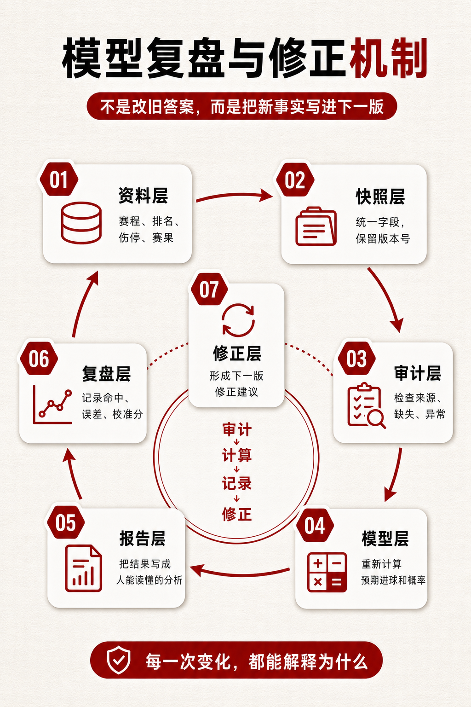
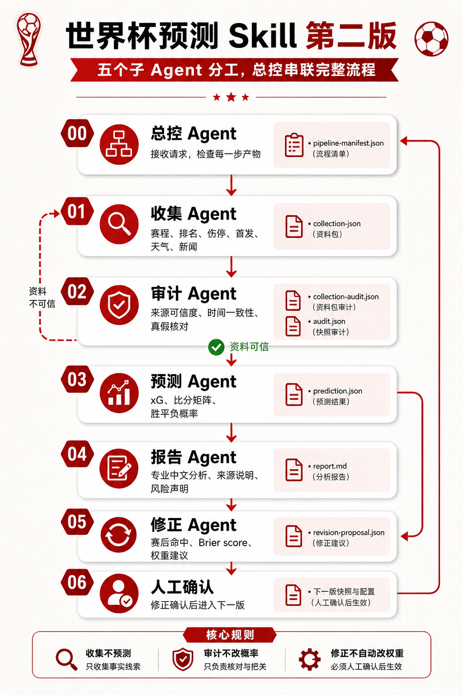

# worldcup-prediction-skill-xiaowo

小蜗版世界杯预测模型 harness：一个可审计、可复盘、可安装的 `skill + CLI + 文档 + 示例数据` 项目。它面向国内 agent 和 AI 爱好者，重点不是“神预测”，而是把一场足球预测拆成可解释、可复核、可重跑、可修正的工程流程。

<p align="center">
  
</p>

它的目标不是“让 AI 猜比分”，而是把预测过程拆成可检查的工程流程：资料进入快照，快照先审计，再由模型计算 xG 和比分矩阵，最后输出胜平负概率、候选比分、专业报告和赛后修正记录。

## 它能做什么

- 审计世界杯比赛输入快照，防止数据版本混用；可选 `snapshotContentHash` 用于发现内容被改但版本号未变。
- 根据球队强度、FIFA/Elo、近期状态、攻防系数、赛地和结构化修正计算 90 分钟胜平负概率。
- 输出完整比分矩阵和概率最高的比分。
- 支持单场预测，也支持按快照批量预测多场比赛。
- 生成带来源版本和事实摘要的专业中文预测分析报告。
- 赛后记录命中、未命中、Brier score 和下一版修正建议。
- 支持第二版多 agent 分工：收集、审计、预测、报告、修正。
- 作为 Codex/Agent skill 安装使用，也可以直接用 CLI 运行。

示例输出见 [sample-generated-report.md](./docs/sample-generated-report.md)。
历史样本总结见 [historical-sample-analysis.md](./docs/historical-sample-analysis.md)。

## 快速开始

环境要求：Node.js 18 或更高版本。

```bash
git clone <your-repo-url>
cd worldcup-prediction-skill-xiaowo
npm test
```

直接运行：

```bash
node ./skills/worldcup-prediction-skill-xiaowo/scripts/audit-input.mjs --data ./examples/snapshots/sample-worldcup-snapshot.json
node ./skills/worldcup-prediction-skill-xiaowo/scripts/predict-match.mjs --data ./examples/snapshots/sample-worldcup-snapshot.json --match ARG-ALG-2026-06-17
```

安装 CLI：

```bash
npm link
worldcup-xiaowo audit --data ./examples/snapshots/sample-worldcup-snapshot.json
worldcup-xiaowo predict --data ./examples/snapshots/sample-worldcup-snapshot.json --match ARG-ALG-2026-06-17
worldcup-xiaowo predict-batch --data ./examples/snapshots/worldcup-2026-07-06-r16-snapshot.json --out-dir ./reports/2026-07-06-r16-batch
worldcup-xiaowo pipeline --data ./examples/snapshots/sample-worldcup-snapshot.json --match ARG-ALG-2026-06-17 --out-dir ./reports/sample-pipeline
```

`predict-batch` 默认只跑 `scheduled` 未开赛比赛；如果为了调试要包含 `in_progress` 进行中比赛，需要显式增加 `--include-live`。`report` 默认要求快照审计通过，坏快照只允许用 `--allow-failed-audit` 进入诊断模式。

安装为 Codex skill：

```powershell
Copy-Item -Recurse .\skills\worldcup-prediction-skill-xiaowo "$env:USERPROFILE\.codex\skills\worldcup-prediction-skill-xiaowo"
```

## v3 通用足球预测骨架

v3 新增独立的 `football-prediction-skill-xiaowo`，覆盖联赛、国内杯赛、洲际俱乐部赛事、国家队赛事和友谊赛。它保留现有世界杯 v1 快速开始、`worldcup-xiaowo` 命令和原有语义；新的发布入口为 `football-xiaowo`，后续 v3 功能在该入口中演进。

验证 v3 骨架：

```bash
npm run test:v3
```

运行 v3 赛前正式流水线：

```bash
npm run pipeline:v3:sample
# 或
node ./skills/football-prediction-skill-xiaowo/scripts/run-pipeline.mjs \
  --input ./skills/football-prediction-skill-xiaowo/assets/sample-data/club-league-snapshot.json \
  --out-dir ./.tmp-v3-pipeline
```

流水线按“输入加载 → 赛事画像与清单校验 → 证据审计 → 审计快照 → 90 分钟预测 → 同源 Markdown/HTML 报告 → PNG 长图与渲染审计 → SHA-256 → 最终清单”的固定顺序运行。每次运行写入 `<out-dir>/<runId>/`；同名运行目录已存在时会直接失败，不覆写旧预测。正式完成要求 `audited-snapshot.json`、`prediction.json`、`report.md`、`report-long.html`、`report-long.png` 和 `render-audit.json` 全部存在、带 SHA-256，且渲染审计无错误，最终索引写入 `run-manifest.json`。

### v3 工程流程图

以下三张原创红白工程图分别限定生命周期、冲突降级和不可变血缘；它们由仓库内 Playwright 脚本确定性生成，不使用第三方品牌或报告版式。

<p align="center">
  
</p>

<p align="center">
  
</p>

<p align="center">
  
</p>

跨 Agent 能力预检、无网络回退、缺失资料上传与赛事画像规则见 [v3 Skill 使用说明](./skills/football-prediction-skill-xiaowo/SKILL.md)。重绘流程图：

```bash
node ./skills/football-prediction-skill-xiaowo/scripts/render-flowcharts.mjs
```

## 概率是根据什么来的

通俗说：模型先估算两队预期进球，再把 0-0 到 7-7 的所有比分列成矩阵。所有主胜比分加起来就是主胜概率，所有平局比分加起来就是平局概率，所有客胜比分加起来就是客胜概率。也就是说，胜率不是一句“AI 觉得”，而是从每个比分格子的概率汇总出来的。

技术上，模型使用：

- 基础实力：`ratingValue`、`eloRating` 或 `fifaRank`。
- 近期状态：`formScore`。
- 攻防强度：`attackStrength`、`defenseStrength`。
- 赛地因素：主办国/比赛地轻微修正。
- 结构化修正：伤停、首发、赛程、复盘等，必须写入 `contextAdjustments` 并通过审计；AI 不能直接改胜率。
- 比分概率：泊松分布 + Dixon-Coles 低比分修正。

详细说明见 [模型方法论](./docs/model-methodology.md)。

## Harness 如何分层和修正

<p align="center">
  
</p>

这个项目把“预测”和“解释”拆开：

- 数据层只负责把外部信息变成统一快照。
- 审计层负责挡住脏数据、错版本和未复核修正。
- 模型层只计算，不写营销文案。
- 报告层只解释模型输出，不手写概率。
- 复盘层记录实际结果、偏差和下一版修正。

修正不是赛后改旧答案，而是新增下一版快照。新伤停、首发、赛果、体能和战术变化必须先变成 `formScoreDelta`、`attackMultiplier`、`defenseMultiplier` 或带版本号的规则，再重新审计和计算。详细说明见 [harness-layering-and-correction.md](./docs/harness-layering-and-correction.md)。

## 第二版多 Agent 工作流

<p align="center">
  
</p>

第二版把一场预测拆成 5 个子 agent 和 1 个总控 agent：

- 收集 Agent：联网收集赛程、排名、伤停、首发、天气、新闻和自媒体线索，输出 `collection.json`。
- 审计 Agent：核对来源、真假、时间一致性和字段格式，输出 `collection-audit.json` 和 `audit.json`。
- 预测 Agent：只吃审计通过的快照，输出 `prediction.json`。
- 报告 Agent：只解释模型输出，生成 `report.md` 或 `combined-report.md`。
- 修正 Agent：赛后读取 `record.json`，生成 `revision-proposal.json`，等待人工确认。
- 总控 Agent：串联所有步骤，输出 `pipeline-manifest.json`。

这套分工的核心是互不越界：收集不预测，审计不改概率，预测不联网，报告不手写胜率，修正不自动改权重。详细说明见 [multi-agent-workflow.md](./skills/worldcup-prediction-skill-xiaowo/references/multi-agent-workflow.md)。

## 项目结构

```text
skills/worldcup-prediction-skill-xiaowo/
  SKILL.md
  agents/openai.yaml
  agents/*.md           # 第二版多 agent 职责说明
  core/                  # 审计、模型、复盘、报告核心代码
  scripts/               # 可直接运行的 CLI 脚本
  references/            # skill 使用说明和方法论
  assets/sample-data/    # 示例数据说明
examples/
  collections/            # 收集 Agent 资料包示例
  snapshots/             # 输入快照示例
  records/               # 赛后复盘记录
docs/                    # 开源文档与审计报告
reports/                 # 本地生成报告输出目录
```

## 样本与历史沉淀

本项目初版参考了本地历史工作流中的样本结构，而不是只靠一个演示文件：

- 18 份 `model-input` 快照，覆盖 2 队、4 场、6 场、淘汰赛等多种批次。
- 54 份标准单场预测 JSON。
- 4 份场景筛选文件，例如 3 球及以上脚本。
- 12 份 Markdown 预测/总结稿。
- 30 份预测输出包含上下文修正说明。
- 4 份淘汰赛输出同时区分 `90minResult` 和 `advanceResult`。

这些样本被整理成 [历史样本分析报告](./docs/historical-sample-analysis.md)，用于说明模型如何从早期单场预测，演进到带审计、带上下文修正、带赛后复盘的 harness。

## 风险声明

本项目用于 AI 模型调试、数据实验和模型边界研究，不构成竞猜、投资或下注建议。作者只是 AI 爱好者，欢迎讨论 AI、数据建模、足球预测方法和模型边界，请理性看待所有概率结果。

## 许可证

MIT License。作者字段：小蜗搬砖。
