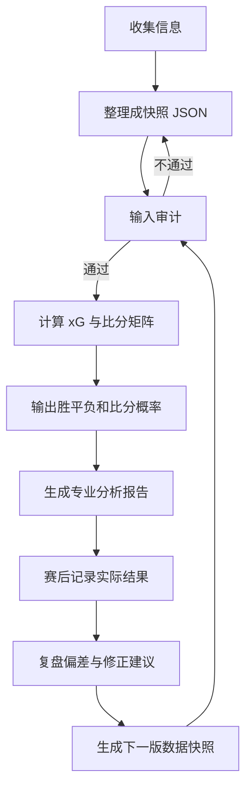

# Harness 工作流

本项目的核心不是一次预测，而是循环。第二版把循环拆成总控 agent 和 5 个子 agent：收集、审计、预测、报告、修正。



更完整的分工见 `multi-agent-workflow.md`。

## 常用命令

```bash
npm run audit
npm run predict:sample
npm run predict:batch-sample
npm run scenario:sample
npm run record:sample
npm run report:sample
npm run pipeline:sample
npm run revise:sample
```

或直接使用 CLI：

```bash
worldcup-xiaowo audit --data ./examples/snapshots/sample-worldcup-snapshot.json
worldcup-xiaowo predict --data ./examples/snapshots/sample-worldcup-snapshot.json --match ARG-ALG-2026-06-17
worldcup-xiaowo predict-batch --data ./examples/snapshots/worldcup-2026-07-06-r16-snapshot.json --out-dir ./reports/2026-07-06-r16-batch
worldcup-xiaowo report --prediction ./reports/sample-arg-alg.prediction.json --out ./reports/report.md
worldcup-xiaowo pipeline --data ./examples/snapshots/sample-worldcup-snapshot.json --match ARG-ALG-2026-06-17 --out-dir ./reports/sample-pipeline
worldcup-xiaowo revise --records ./examples/records/sample-arg-alg.record.json --out ./reports/sample-revision-proposal.json
```

`predict-batch` 默认只处理 `scheduled` 比赛。需要诊断进行中比赛时才加 `--include-live`。`report` 默认拒绝审计失败的快照，只有排查坏数据时才加 `--allow-failed-audit`。

## 输出分层

- `prediction.json`: 机器可读的预测结果。
- `batch-summary.json`: 多场比赛批量预测汇总。
- `scenario.json`: 从比分矩阵筛出来的场景脚本，例如总进球大于等于 3。
- `record.json`: 赛后复盘记录。
- `report.md`: 给人看的专业中文分析报告，包含来源版本和事实摘要。
- `collection.json`: 收集 Agent 的资料包。
- `collection-audit.json`: 审计 Agent 对资料包的核验结果。
- `pipeline-manifest.json`: 总控 Agent 对完整流程的运行清单。
- `revision-proposal.json`: 修正 Agent 的赛后修正建议，必须人工确认后才能进入下一版。

## 版本与哈希防护

- `dataVersion`: 由来源版本和强度版本生成，防止不同批次来源混用。
- `snapshotContentHash`: 可选但推荐，覆盖球队、比赛、修正和事实摘要，防止同一版本号下内容被改动。
- `matchId`: 只能使用字母、数字、点、下划线和连字符，因为批量预测会用它生成输出文件名。
