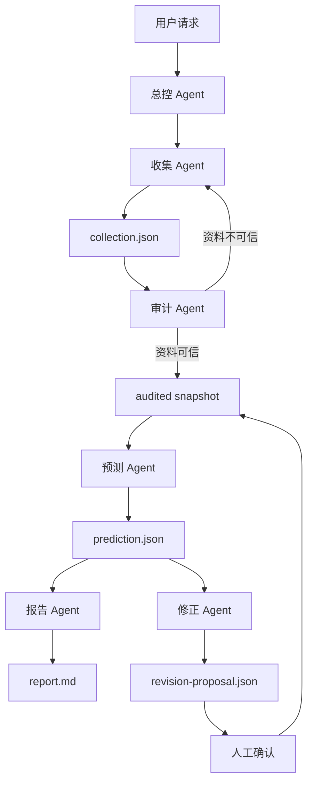

# 多 Agent 工作流

第二版把一条预测拆成 5 个子 agent 和 1 个总控 agent。这样做的目的不是增加复杂度，而是避免一个 agent 同时收集、判断、计算和写报告时互相污染。

## 角色分工

| 角色 | 只负责 | 输出 |
| --- | --- | --- |
| 收集 Agent | 收集赛程、排名、伤停、首发、天气、新闻和自媒体线索 | `collection.json` |
| 审计 Agent | 核对来源、真假、时间一致性、版本和字段 | `collection-audit.json`、`audit.json` |
| 预测 Agent | 用审计通过的快照计算 xG、比分矩阵和胜平负概率 | `prediction.json` |
| 报告 Agent | 把模型输出写成专业中文报告 | `report.md` |
| 修正 Agent | 赛后总结命中、偏差和权重修正建议 | `revision-proposal.json` |
| 总控 Agent | 串联流程、检查产物、写清单 | `pipeline-manifest.json` |

## 流程



## 总控命令

单场：

```bash
worldcup-xiaowo pipeline --data snapshot.json --match <matchId> --out-dir reports/run
```

批量：

```bash
worldcup-xiaowo pipeline --data snapshot.json --batch --out-dir reports/batch-run
```

如果已经有收集资料包：

```bash
worldcup-xiaowo pipeline --collection collection.json --data snapshot.json --match <matchId> --out-dir reports/run
```

## 边界

- 收集 Agent 不预测。
- 审计 Agent 不改概率。
- 预测 Agent 不联网。
- 报告 Agent 不手写概率。
- 修正 Agent 不自动改权重。
- 总控 Agent 不跳过审计。
